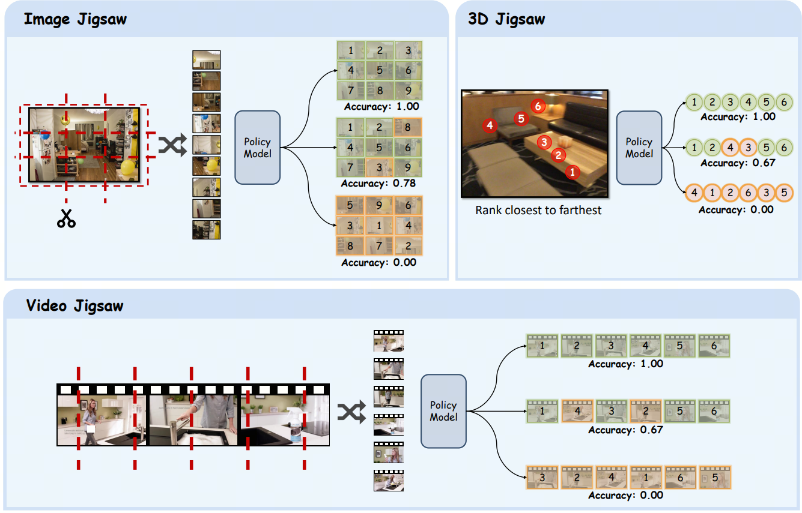

<h1 align="center"><a href="https://arxiv.org/" style="color:#9C276A">
Visual Jigsaw Post-Training Improves MLLMs</a></h1>

<h5 align="center">
  
[](https://your-project-page-link)
[](https://huggingface.co/collections/craigwu/visual-jigsaw-68d92d6aca580f3dc7e3cf36)
[](https://arxiv.org/abs/)
<br>
</h5> 

## Visual Jigsaw
Visual Jigsaw is a generic self-supervised post-training framework designed to strengthen visual understanding in MLLMs. It is formulated as a general ordering task: visual inputs are partitioned, shuffled, and the model must reconstruct the visual information by producing the correct permutation in natural language. We provide the instantiations of Visual Jigsaw across three visual modalities, including images, videos, and 3D data.

<p align="center">

</p>

## Model Checkpoints

We release the following models trained with Visual Jigsaw from [Qwen2.5-VL-7B-Instruct](https://huggingface.co/Qwen/Qwen2.5-VL-7B-Instruct):

**[Visual Jigsaw Image 7B](https://huggingface.co/craigwu/visual_jigsaw_image_7B):** Qwen2.5-VL-7B-Instruct trained with image jigsaw  
**[Visual Jigsaw Video 7B](https://huggingface.co/craigwu/visual_jigsaw_video_7B):** Qwen2.5-VL-7B-Instruct trained with video jigsaw  
**[Visual Jigsaw 3D 7B](https://huggingface.co/craigwu/visual_jigsaw_3D_7B):** Qwen2.5-VL-7B-Instruct trained with 3D jigsaw  

## Visual Jigsaw Training Data

The training data for Visual Jigsaw can be downloaded at [visual_jigsaw_training_data](https://huggingface.co/datasets/craigwu/visual_jigsaw_training_data).

For the image jigsaw task, we use the images from [COCO](https://cocodataset.org/#download) 2017 training split.  
For the video jigsaw task, we use the videos from [LLaVa-Video](https://huggingface.co/datasets/lmms-lab/LLaVA-Video-178K).  
For the 3D jigsaw task, we use the RGB images from [ScanNet](https://github.com/ScanNet/ScanNet). 

For training, you need to download the source data from the above source datasets.

## Training

The training scripts for Visual Jigsaw training are provided in `train_scripts\`.

## Evaluation

For evaluation, please see guidelines in [eval.md](https://github.com/penghao-wu/visual_jigsaw/blob/main/eval/eval.md).

## License <a name="license"></a>

This project is under the Apache-2.0 license. See [LICENSE](LICENSE) for details.

## Citation <a name="citation"></a>
Please consider citing our paper if you find this project helpful for your research:

```bibtex
@article{visual_jigsaw,
  author    = {Wu, Penghao and Yushan, Zhang and Haiwen, Diao and Bo, Li and Lu, Lewei and Liu, Ziwei},
  title     = {Visual Jigsaw Post-Training Improves MLLMs},
  journal={arXiv preprint arXiv:2509},
  year={2025}}
```

## Acknowledgement <a name="acknowledgement"></a>
-  This work is built upon [verl](https://github.com/volcengine/verl). 

